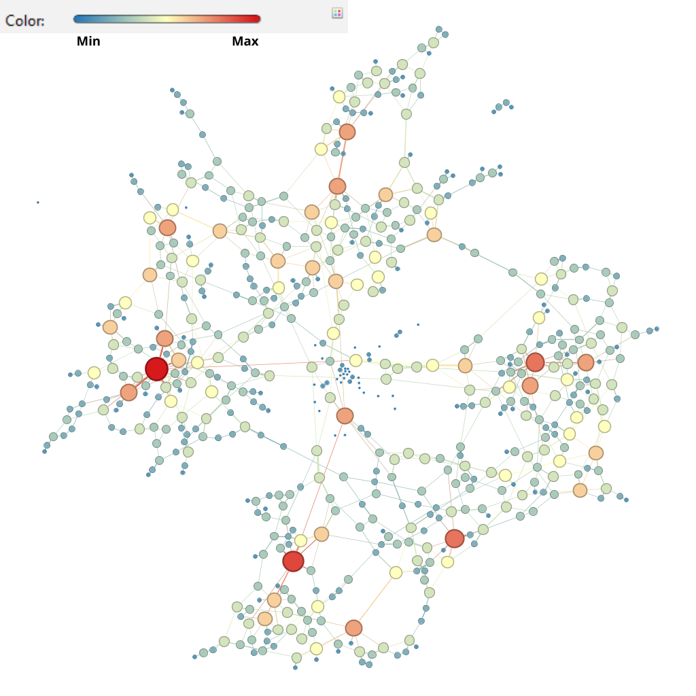
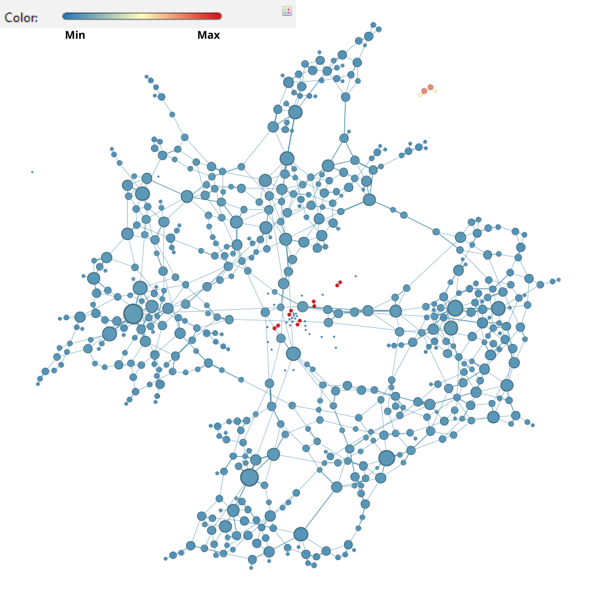
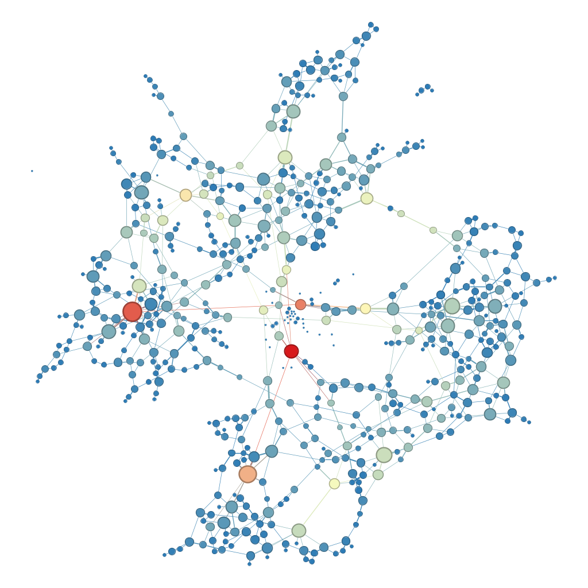
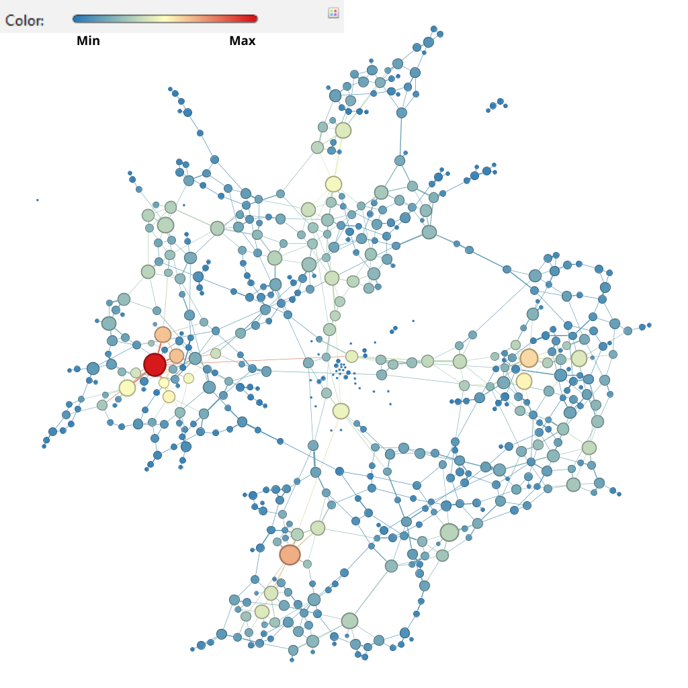
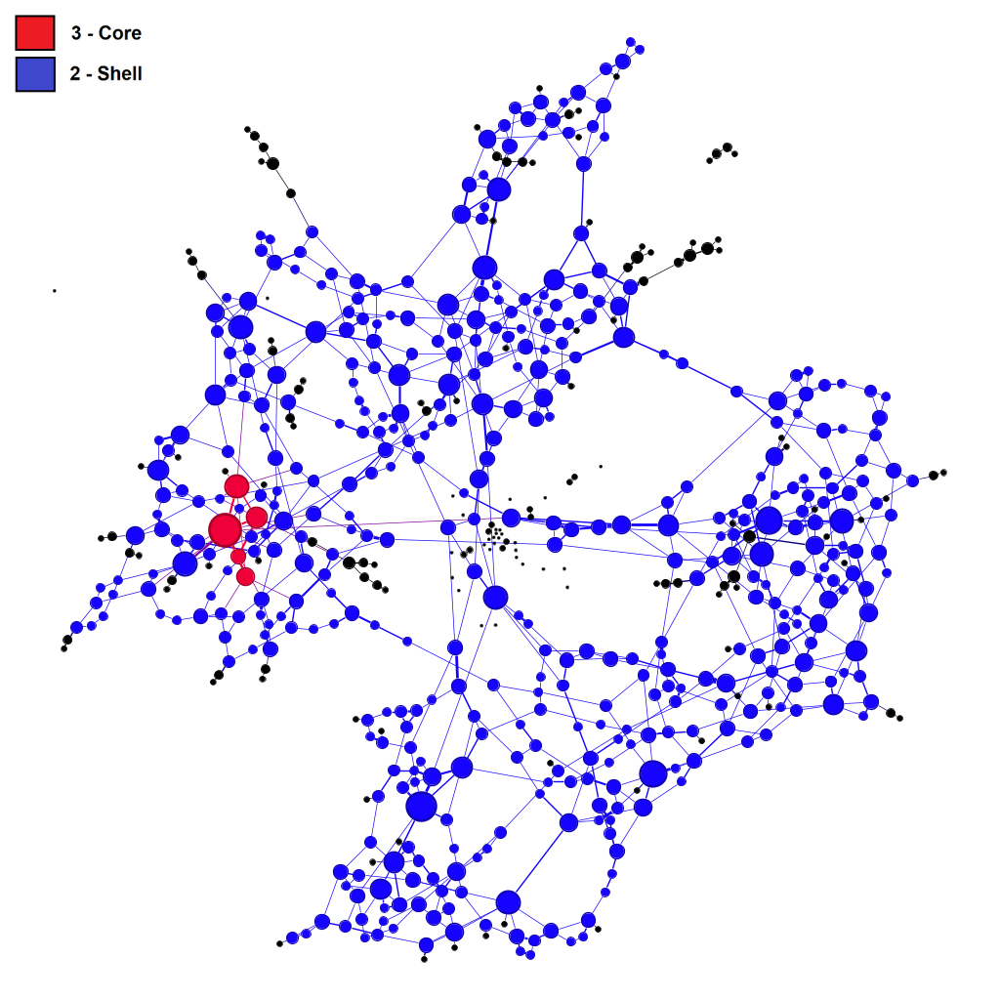
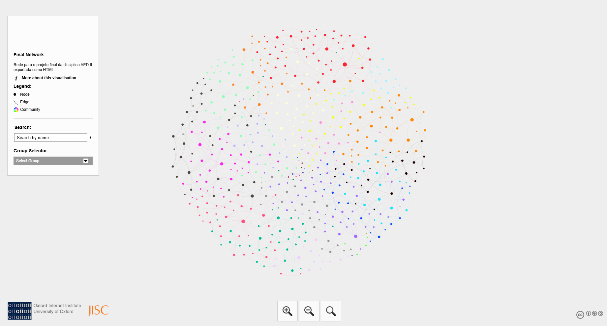

# Projeto Final - AED II

## Apresentação
[Link para a apresentação](LINK)

## Integrantes do Grupo
- Gustavo Pereira de Carvalho
- André Luiz Lima Souza
- Celine Helena Abrantes de Andrade

## Contextualização
> Explicar o que deveria ser feito no trabalho.

## Requisitos

### Requisito 1
- Explicação da(s) métrica(s) utilizada(s).

### Requisito 2
- Explicação da(s) métrica(s) utilizada(s).

### Requisito 3
- Explicação da(s) métrica(s) utilizada(s).

## Metodologia
- Código utilizado  
- Dados utilizados  

## Organização do Repositório
> Descrever a estrutura de pastas e arquivos.

## Resultados

### Requisito 1
- Imagem:

<strong>Figura 1:</strong> Degree Centrality.

 

<strong>Figura 2:</strong> Closeness Centrality.

 

<strong>Figura 3:</strong> Betweenness Centrality.

 

<strong>Figura 4:</strong> Eigenvector Centrality.

- Explicação:

### Requisito 2
- Imagem:

<strong>Figura 5:</strong> K-core e K-shell.

  
- Explicação:

### Requisito 3
- Imagem:

<strong>Figura 6:</strong> Página HTML.

  
- Explicação:
- Link para página: [Link](LINK_DA_PAGINA)
