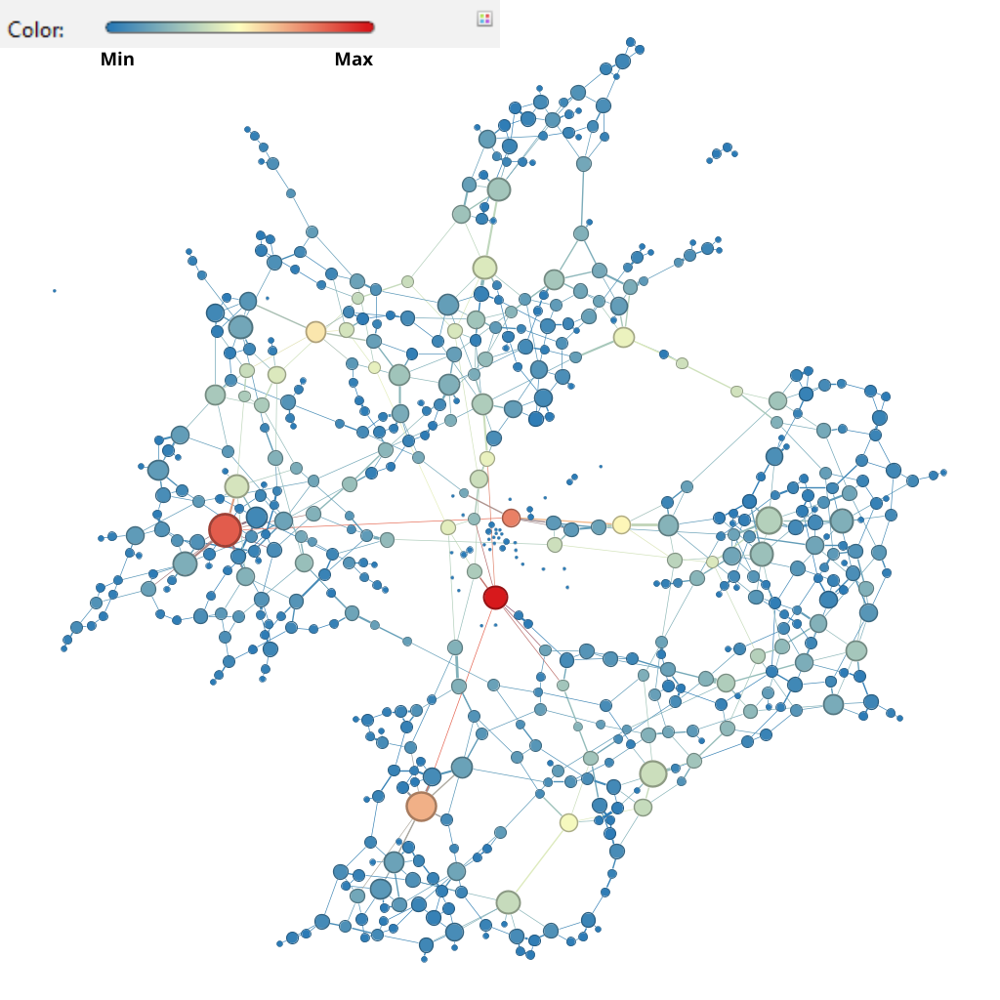

# Projeto Final - AED II

## Apresentação
[Link para a apresentação](LINK)

## Integrantes do Grupo
- Gustavo Pereira de Carvalho
- André Luiz Lima Souza
- Celine Helena Abrantes de Andrade

## Contextualização
> Explicar o que deveria ser feito no trabalho.

## Requisitos

### Requisito 1
- Explicação da(s) métrica(s) utilizada(s).

### Requisito 2
- Explicação da(s) métrica(s) utilizada(s).

### Requisito 3
- Explicação da(s) métrica(s) utilizada(s).

## Metodologia
- Código utilizado  
- Dados utilizados  

## Organização do Repositório
> Descrever a estrutura de pastas e arquivos.

## Resultados

### Requisito #01: Análise das Centralidades

A análise de centralidade em redes nos permite identificar os nós mais importantes ou influentes dentro de uma estrutura, sob diferentes perspectivas. Ao examinarmos os grafos apresentados, podemos observar as nuances de quatro métricas-chave: Degree, Closeness, Betweenness e Eigenvector Centrality.

#### 1. Degree Centrality (Centralidade de Grau)
Como podemos analisar na figura abaixo, a codificação das cores segue a seguinte lógica: quanto mais puxando para o verde, menor a centralidade de grau do nó; e quanto mais puxando para o vermelho, maior sua centralidade. Observamos a presença de quatro nós de cor vermelha intensa (e possivelmente maior tamanho), indicando uma centralidade de grau muito alta, ou seja, eles possuem um número significativamente elevado de ligações (ou conexões) diretas com outros nós. Embora existam vários nós com centralidade intermediária (em tons de laranja), a concentração dos pontos de maior centralidade nesta rede está justamente nesses poucos nós vermelhos, que atuam como hubs conectando diversas partes da estrutura.

<strong>Figura 1:</strong> Degree Centrality.

#### 2. Closeness Centrality (Centralidade de Proximidade)
No grafo que representa a Closeness Centrality, a coloração dos nós indica a distância média de um nó para todos os outros na rede. Nós em tons de azul possuem uma distância média menor, significando que são facilmente acessíveis e estão "próximos" de todos os outros pontos. Por outro lado, nós em tons de vermelho indicam uma distância média maior. No nosso grafo, os poucos nós vermelhos observados são, na verdade, "ilhas" ou componentes desconectados da rede principal. Apesar de estarem próximos entre si dentro de suas respectivas ilhas, a inacessibilidade ao restante do grafo eleva drasticamente sua distância média para o conjunto total de nós, confirmando sua baixa centralidade de proximidade.

<strong>Figura 2:</strong> Closeness Centrality.

#### 3. Betweenness Centrality (Centralidade de Intermediação)
O grafo de Betweenness Centrality destaca os nós que atuam como "pontes" ou intermediários no fluxo de informação da rede. Nós com alta centralidade de intermediação são representados por cores mais intensas (vermelho/laranja) e, por vezes, maior tamanho, indicando sua importância estratégica na conexão entre diferentes partes do grafo. É crucial diferenciar esta métrica da centralidade de grau: enquanto o grau mede apenas o número de conexões diretas, a intermediação avalia a frequência com que um nó se encontra no caminho mais curto entre outros pares de nós. No nosso grafo, percebemos claramente que os nós mais vermelhos, embora não necessariamente os de maior grau, são vitais para ligar diversos conjuntos de nós, confirmando seu papel como conectores essenciais e validando a singularidade da Betweenness Centrality em relação à contagem simples de ligações.

<strong>Figura 3:</strong> Betweenness Centrality.

#### 4. Eigenvector Centrality (Centralidade de Autovetor)
Por fim, o grafo de Eigenvector Centrality ilustra a influência de um nó na rede, considerando não apenas a quantidade, mas a "qualidade" de suas conexões. Esta métrica reflete o princípio de que estar conectado a nós já influentes aumenta a própria influência. Como na analogia de ter um amigo influente (CR7) em vez de muitos amigos não influentes, a importância aqui deriva das conexões com nós bem conectados e relevantes. No grafo, o nó proeminentemente vermelho demonstra possuir uma alta centralidade de autovetor. Isso indica que, mesmo que seu número de conexões diretas não seja o maior, ele está estrategicamente ligado a outros nós que são, por sua vez, altamente influentes, propagando sua própria importância através dessas conexões de alto valor e estabelecendo-o como um nó de grande influência na rede.

<strong>Figura 4:</strong> Eigenvector Centrality.

### Requisito #02: K-core e K-shell

<strong>Figura 5:</strong> K-core e K-shell.

### Requisito #03: Página HTML Interativa

<strong>Figura 6:</strong> Página HTML.

- **Link para página:** [Link](https://gustavo2h.github.io/Final_Project_AED2/)

